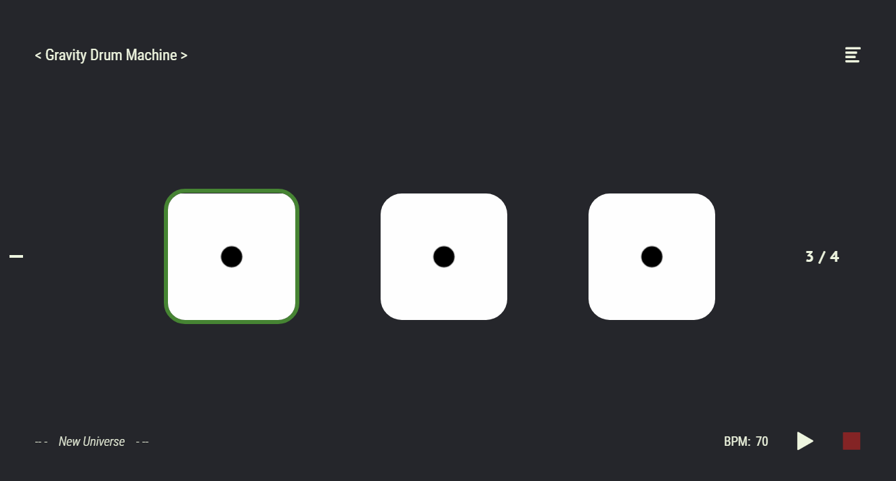
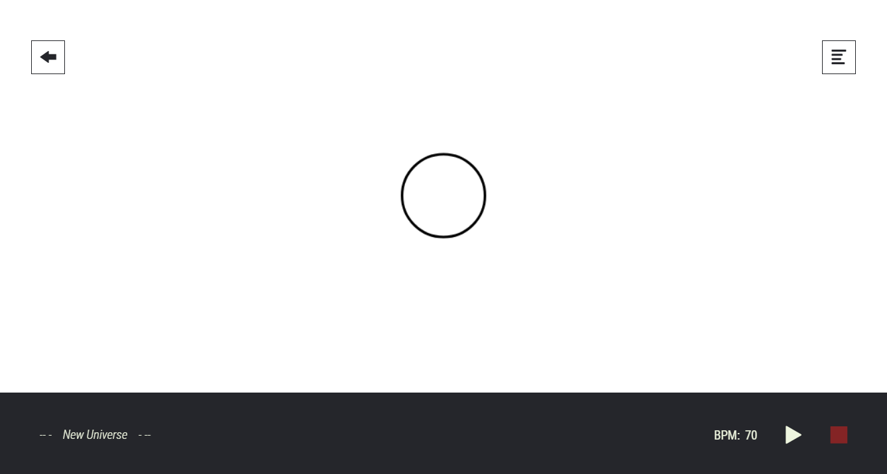
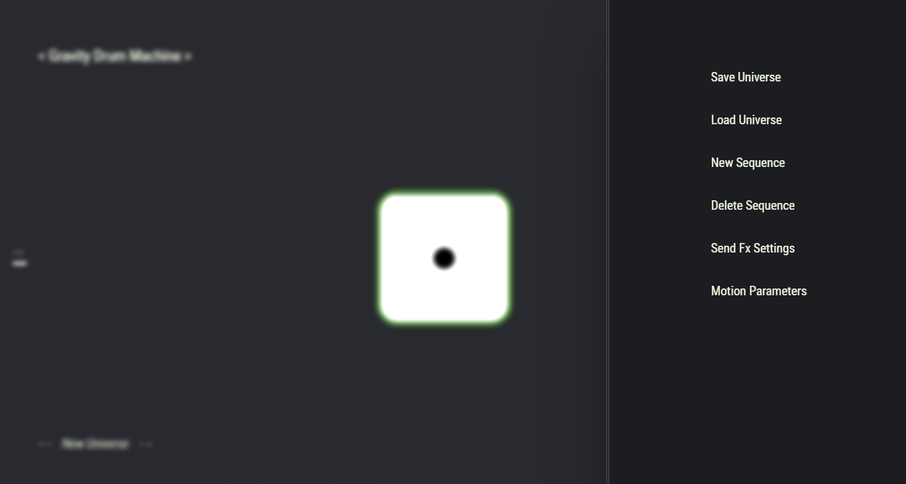
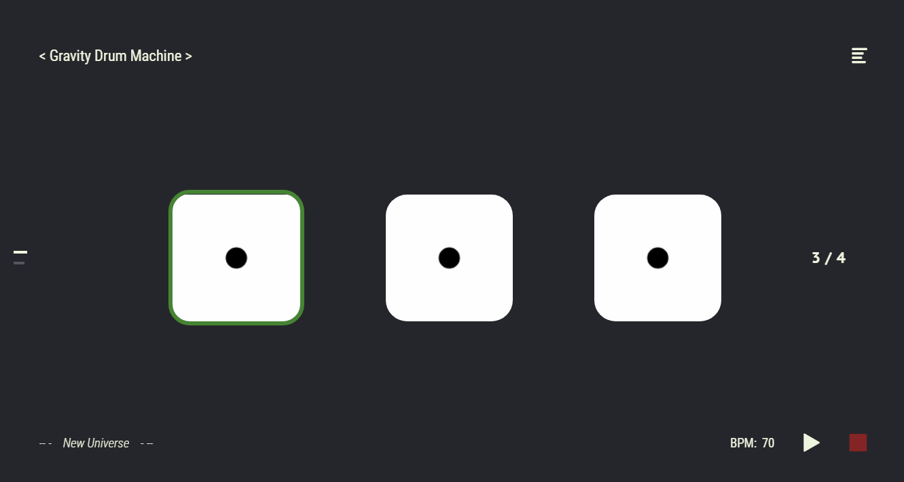

# Gravity Drum Machine

*Jacopo Piccirillo*

*Federico Di Marzo*

*February 2020*

https://www.youtube.com/watch?v=fZK9mQ1Q3T8&feature=youtu.be
https://federicodimarzo.github.io/GravityDrumMachine/

## Introduction
Linearity is not the most enjoyed parameterization when it comes to perception of sound. *Complex* is -*somehow*- a more enjoyed and natural behavior. 

Even if modern drum-machines offer many different and inspiring tools devoted to rhythm, they seldom allow to explore sound generation in a *chaotic* 
fashion.
To create interesting and everchanging percussive textures, we thought it could be particularly useful to superimpose different chaotic rhythmic elements 
to simpler patterns.

The concept of unpredictability has already been covered from hardware and software drum-machine manufactures in terms of conditional step triggering or 
geometrical pseudo randomization.
Anyway, we wandered more and thought about: *what if we could develop a system that automates sound morphing and generation according to the laws of nature?* 

From these main ideas the gravity drum machine concept was born.

   

* ### Main features
 
    *Gravity field*
    
   * The basic concept of this software is to simulate a universe in which motion is determined by a **gravity field**. The universe has a signature 
   associated (*e.g. 3/4:5/8*) which can be determined by the user. Every step in the signature is associated to a different system which starts its motion 
   when tempo triggers the associated step. In every system there is a black ball which generates a gravity field and, when not muted, gets triggered 
   emitting a sound every time the simulation starts. User can put other (*randomly coloured*) balls inside which will move according to the laws of gravitational 
   motion and sound when they'll collide with the black ball. 
   
   *Physical motion*
       
    * Every kind of (*complex esponential, solution of a second order differential equation, ..*) physical motion can be simulated with this software, from circular motion to damped oscillation, as better specified later.
    
   *Polyrhythms*
    
   * The software can simulate more than a galaxy at the same time, each associated with his own time signature. This will result in the capability of 
   generating a universe sounding as every kind of **polyrhythm**, whith the possibility of the superposition of **linear** and **non-linear** behaviours with 
   the addition of moving balls by the user.
   
    *Positional panning*
     
    * Sound emitted by moving objects are **panned as their position** in the simulation, resulting in a dynamic stereo pan effect, improving audio/video 
    perception.
    
     *Motion modulation*
     
    * Behaviours can be automated following **gravity-motion equations patterns**, resulting in complex exponential behaviours. There will be damped 
    behaviours in colliding balls, which will go subject also to a friction force. Non-colliding balls will not be subject to friction. 
    
     *Double view*
     
    * There are two views in this drum machine, the first called **Galaxy view** which has a standard -*sequencer fashioned*- architecture. Inside the 
    **Galaxy view** there will be one or more systems (*e.g. three for a 3/4 galaxy, one for every step of the sequence*), and all of them will be 
    accessible via the **System view**. Inside the **System view** gravity motion happens. Systems get triggered, starting and ending their sound and 
    motion, by the **metronome**.
    
    *Dynamic forces*
         
     * Amplitude of gravitational and frictional forces can be changed (*via force constants scaling*), resulting in a **dynamic** physical model.
 
* ### Limits and future features
   Along with the physical impossibility of subdividing time under certain orders, the "**tone.js**" library we used does not support infinitely dense time 
   subdivisions. Supporting polyrhythms leads to frequencies of the order from *pow(2,n)* to *pow(n,n)*, n being how many prime numbers are divisors of at 
   least one denominator, which tone magnifies 127 times by the "**tone.js**" library object used to handle tempo. Frequencies can become very high especially 
   when metric measure subdivisions (*i.e. denominator of metric signatures*) **are (or are divided by) lots of different prime numbers**, leading to very 
   small time subdivisions and possible errors.  
   
   *Hardware limits warning*: if one implements particularly complex sound patterns using this software having a not very powerful hardware on his machine, application can lag, especially if Operating System implements **GPU audio processing**. If so, try reducing size of the window in which application is loaded to avoid lagging. **If one has powerful hardware this is not an issue**.
 
   We are currently focused on doppler-effect features, enhancement of modulation possibilities, harmonic and melodic sound pattern generation and overall 
   interface improvement.
  
  *More will come*

## Overview

<figure>
  <figcaption>-->Figure 1: New project<-- </figcaption>
  
</figure>

When loaded the software will display a black screen in which the universe will be composed of a single **galaxy** associated with a 1/4 signature. Therefore 
the newborn universe will be started containing one single galaxy which will itself contain one single system, this represented by the single green-margined 
central square shown in the center of Figure 1. We will call in this text what is shown in Figure 1 and 2 "***Galaxy view***" to distinguish it from the 
"***System view***", which usage will become clear later in this overview.

On the top right corner we find an icon that will show a menu when clicked, giving the option of **saving** the current project or **loading** a previously 
saved one, along with the option of **creating** or destroying **sequences** (*i.e. **galaxies***). 

Under that icon we find the rhythmic metric associated with the newborn **galaxy**, which can be modified by clicking on it: a popup will appear in which the 
metric can be reset. By doing that new systems will be spawned (or canceled if the numerator of the metric gets decreased), all of them composed in the 
beginning just by a central, gravity attracting, black ball.

<figure>
  <figcaption>-->Figure 2: 3/4 galaxy<-- </figcaption>
  
</figure>

Moving towards the bottom right corner we find **play** and **stop** buttons, which can be toggled also by pressing the **spacebar**. **BPMs** are located 
left of them; a pop-up will spawn when clicking  giving the possibility of changing them. On the bottom left we find the **galaxy name**, which can be reset 
by clicking on it and typing the desired name in the pop-up that will appear.

On the top-left we find just the name of the software and under that -*i.e. center left*- a thin **bar**. Usage of aforementioned **bar** will be clear when 
how to generate **polyrhythms** will be discussed.

We have so covered the **galaxy view** and move now forward towards the **system view**.

<figure>
  <figcaption>-->Figure 3: System view<-- </figcaption>
  
</figure>

Clicking on one of the systems user will be projected into the **system view** which will appear as a blank space populated initially only by the central gravity ball.

We here find the same already described features of the **galaxy view**, with no thin bar displayed and with the software name substituted by a left-pointing 
arrow, which gives the possibility of going back to galaxy view when clicked on.

The central ball will emit a sound when the **metronome** triggers its system. Central balls can also be muted: when in pause, clicking on the central ball 
will cause it to go empty, representing the fact that the ball is now muted (but still attracting other balls). Clicking on it again will unmute it. 

<figure>
  <figcaption>-->Figure 5: Muted gravity ball<-- </figcaption>
  
</figure>

Always 
when in pause, clicking everywhere in the blank space will generate other balls, that will be attracted by the central ball, emitting a sound when colliding. 
Clicking on them again will remove them, clicking and holding will give the possibility of dragging them around.

Right clicking on a ball generates a pop-up menu which gives, among the other options, possibilities of choosing from a wide range of possible motions,
 choosing between a sampler and a monosynth and choosing triggered note. This menu will be better explained later in 
the **Sound Module** section.

<figure>
  <figcaption>-->Figure 4: Adding balls<-- </figcaption>
  
</figure>

You are now **Up&Going**! Open your software, set your rhythmic signature, place balls inside the system and hit play to watch them sound as systems evolve, or enjoy a more broad view stepping in the galaxy. Have fun! 

## Advanced usage

<figure>
  <figcaption>-->Figure 6: Menu<-- </figcaption>
  
</figure>

We until now have understood how to initiate and make a single galaxy sound. Now we will focus on a deeper usage.

### Multiple galaxies and polyrhythms
We already talked about the possibility of simulating more than one galaxy in order to obtain a more-complex, polyrhythmical behaviour. To do so, all we have 
to do is to add other galaxies, set all of them as we already discussed previously for a single one and hit play.

<figure>
  <figcaption>-->Figure 7: 3/4 galaxy in a 3/4:5/8 universe<-- </figcaption>
  
</figure>

To create a new galaxy we have to click on "***New Sequence***" from the menu (Fig.6). This will generate an entire new galaxy, superimposed  with the previous
 one. We will see the white bar in the middle left now having the possibility of moving through 2 different states, indexing the two currently existing 
 galaxies. Every time we want to create a galaxy we have to iterate the process. States will increase by one every time a new galaxy gets created in the universe and decrease by one when destroyed. *Currently there is no limit for the number of states*. 

To remove a galaxy scroll to it and click "***Delete Sequence***" from the menu.

<figure>
  <figcaption>-->Figure 8: 5/8 galaxy in a 3/4:5/8 universe<-- </figcaption>
  
</figure>

Hitting up and down arrow will scroll through the index, currispondent galaxy showing on the screen. 

### Sound FX settings

Selecting "**Sound FX settings**" from the **main menu** will spawn a pop-up containing three sliders: 

* *Delay time*

* *Delay feedback*

* *Reverb size*

These will be parameters of a shared **FX Channel Bus** to which sound signal can be sent from every **Sound module**, as described in next section. 
The *Fx Channel* is connected to **master channel** and user will perceive the superposition of the two signals. The send **gain** 
will be controlled via reverb and delay *send sliders* from the **Sound Module**'s setting menu.  

### Sound modules and their menu
Either attracting and moving balls contain a **sound module**. This will contain a sound source along with the possibilities of 
changing some of its parameters and automating them over time. Attack of sources will be triggered by **collisions** or **metronome**.

**Right clicking** on a ball will pop-up a menu which will give the possibility of changing ball's size
(*we remind here that an increased size will not affect acceleration of the object*), triggered note, audio module contained 
(sample or monosynth right now). Along with the size slider there will be another two, one regulating delay send and the other reverb send. 

Finally we find two drop-down menus: one for selecting desired trajectory and one for choosing between different sources.

* #### Every audio module will have some other options inside this menu:

   *Sampler*
    
   * Selectable sample via drop-down menu.
   
   * Release slider.
   
   * Randomize checkbox: selecting will trigger every time a random note.
   
   * Dynamic pitch checkbox: selecting will shift pitch according to distance from the gravity ball.
   
   *Mono Synth*
   
   * Amp attack slider.
   
   * Amp release slider.
   
   * Filter attack slider.
   
   * Filter release slider.
   
   * Filter cutoff slider.
   
   * Filter envelope amount slider.
   
   * Detune slider.
   
   * Dynamic filter checkbox: selecting will change the cutoff frequency according to distance from the gravity ball.
   
### Copy-paste
Hitting left and right arrow in the galaxy view will scroll through galaxy's systems, the selected one being surrounded by a green margin. Pressing 
**cmd(ctrl) + c** will copy the selected system, which can be pasted in another one by moving over it and pressing **cmd(ctrl) + v**.

### Saving and loading universes
It is possible to save the configuration obtained for future usages, by clicking on "***Save Universe***" from the menu. Doing so will spawn a pop-up containing 
a link which will download a "***.galaxy***" object. Name of the object will be the same as the universe.

To reload the configuration, it is sufficient to click on "***Load Universe***" from the menu and load the object back from where it was stored through the 
pop-up that will appear. 

### Keyboard shortcuts

   - Press "***u***" to switch from **system** to **galaxy view** and vice-versa.
   - Press "***spacebar***" to toggle play and stop.
   - Press "***cmd(ctrl) + c***" to copy a system and "***cmd(ctrl) + v***" to paste it.
   - Select **System** with **left** and **right** arrow.
   - Select **Galaxy** with **up** and **down** arrow.
   
### Motion parameters

Selecting "**Motion Parameters**" from **main menu** will make appear a pop-up menu containing two sliders, giving the possibility to modify **gravity** and 
**friction**'s intensity.

"**G constant**" will modify **gravity**, while "**friction**" will modify **friction**.
   
## Physics' insights

Everything here works under rigorous physical laws. For a deeper understanding of the automation possibility of this software it is worth having a look at its 
physics. We will enumerate the different possible types of motion and what kind of automation one can get from it.

Automations can be taken in this software as the temporal evolution of coordinates and velocities of the objects. The graph **coordinate(velocity)-time**
 will correspond to the **envelope** obtained.

* #### Colliding Motions
   This motion will be an *harmonic damped oscillator*. An exact **harmonic damped envelope** can be found in the time-evolution of the radius of a colliding 
   ball.
   
   We currently implemented three options for collisions:
   
   *Free fall*
   
   *  Ball will have zero initial velocity and simply fall towards the gravity ball.
   
   *Collision hard (coll-hard in sound module menu)*
   
   *  Energy will be above zero in this case and ball will be shooted with high velocity pointing to gravity ball, colliding only one time and then moving away without falling again (since Energy > 0).
   
   *Collision soft (coll-soft in sound module menu)*
   
   *  Energy will be below amount needed to orbit, so ball will collide more than one time. Initial velocity will have a random-generated angle between (-PI, PI) with respect to radius direction, since Energy balance allows us to be sure that shooting in every direction will make the ball collide, if it has enough time to do that (*if tempo is too fast it could happen that system resets its motion before ball actually falls*). This will result in lots of possibilities of trajectories and peculiar automations.
   
**All aforementioned trajectories will resent of friction and result in a damped oscillation behaviour; belove non-colliding orbits are described, which will not resent of friction**.
   
* #### Circular motion 
   Both x and y coordinates follow a periodic sine-cosine behaviour. From x and y coordinates we can get a **sine wave** behaviour (**y**) and a 
   **cosine wave** one (**x**), so the second one having PI/2 phase shift from the first one. Frequency will be the frequency of the motion.
   
   *More*, from the angle we can get a linear behaviour, wich will result in a **sawtooth-wave modulation**. Frequency of the wave will be proportional 
   directly to velocity and inversely to radius of the ball, slope inverting according to clockwise/conuter-clockwise motion. 
   
* #### Elliptical motion
   Elliptical motion can be decomposed over the superposition of two perpendicular harmonic motions at different frequencies. This means that in general 
   one will get linear combinations of two different sine-fashioned waves in the time evolution of x and y, and so an automatization following a pattern of 
   the sum (or difference) of **two sine oscillators with a different gain**.
   
  Radius and angle will follow more complex (and worth exploring) **periodic** patterns. Same can be said about the slope of the angular evolution as in the 
  circular case.
  
* #### Hyperbolic motion
   The ball will describe a parabola with one focus situated where the gravity ball is. Radius will be equivalent to the distance of the ball by the focus. 
   From this case  can be computed a non.linear **hyperbolic** behaviour.
   
* #### Parabolic motion
   In this case balls follow the pattern of a parabola in which the radius represents the distance from its focus. From this case can be computed a non-linear 
   ***pow(x,2)*** behaviour.
   
**Excepting collision hard, initial velocities are computed with inverse proportionality with respect to the radius, so velocity will be higher when near and slower when far. The opposite stands for collision hard**.

*In future we will implement the possibility for the user to decide velocity magnitude himself*.
   
##### Dynamic forces notes:

Initial velocity when selecting peculiar trajectory will be computed at the time one clicks on the desired one from the drop-down menu.
When scaling through the menu  gravity and friction it is suggestable first to scale forces and then select desired trajectory. Doing otherwise will compute
the trajectory using old data which will result in an unpredictable motion. 
   
##### Selectable trajectories notes:

Every aforementioned trajectory can be selected fom the drop-down trajectory menu. These will all have a random component, either in the angle or in
initial velocity or both. We used a trick in order not to have collisions from every point in which a ball can be dropped: under certain radiuses elliptic
orbit will decade in a circular one. This because motion's computations are made considering every ball as a single point in space. When placing a ball too near the gravity one,
elliptic orbits will be computed going through the portion of space occupied by the gravity ball and this will result in a collision.

This is not entirely resolvable if not by widening more the minor axis and compriming more the major one of the ellipsis, so in the end selecting elliptical motion
being too close to the gravity center will make the trajectory collapse in a circular one, in order to avoid collisions. 

*The possibility of collision when not desired is minimum but there is a tight area in which this could still happen, under very unfortunate conditions.
If so, try reducing ball's size in order to avoid it.*
   
## Code architecture
Our **Gravity Drum Machine** has been developed as a dynamic web application, based on the *Web Audio API*.
The application is delivered to the user from the server as an index html page, connected to many styles and javascript modules.

In this section the code architecture is depicted broadly, to introduce the main interrelated components that form the final product.

* #### MVC structure
Scalability was one of our main concern during development; we aimed to gradually add new components and options to our drum machine, avoiding unnecessary complexity in the code structure.

To pursue this intention, we arranged our code in a MVC fashion, exploiting many useful tools and proper schemes of web apps.

Our **view** is defined in many *html* pages, that can be composed in a modular way, allowing us to create a single isolated file for every component of the product.   
The graphical style has been enhanced with css style files.

The **model** comprises many javascript modules, each one containing information about physical properties or audio parameters.

All the logic in the application, that connects the user interaction in the view, with model updating, is delegated to two *controller* modules.
To allow an automatic update of model properties, most html input tags have an *auto-update* class, used inside the controller to send input's values to a model object, that updates independently.
This design choice offers a clean and easy way to add functionalities to the application without worrying about updating the controller's code every time.  

* #### Graphical rendering
The drum machine was designed to be fun to interact with and graphically appealing; to support these principles, we needed as much freedom as a web environment could offer.
We used an **html canvas** component to draw our evolving universes, all the rendering process delegated to the **GraphicRenderer** class.

This class takes all the information needed for showing the evolution of the universe directly from the model. The rendering is completely independent from the rate at which the model is updated.
 
The standard **window.requestAnimationFrame** function is used to exploit GPU acceleration, allowing for smooth animations even on high CPU load.   

* #### Physical modeling
Our project started from a physical modeling of **gravity motion**, to which we added the possibility of **frictional forces**.

We hand-coded all the logic behind the simulation, without using external libraries, because we felt the need to design our model over our very specific needs, allowing for a **better integration** and **performance optimization**.  

* #### Step sequencing
Aside from the *GraphicRenderer*, many other components needed some mechanism to handle regular time updates.
To accomplish the task, we developed the **Metronome** class, that internally uses **Tone.Transport** (*a Tone.js component*) with a custom **event handling system**.
 
Every drum-machine is based on the concept of rhythmic **step triggering**; a *clock system* designed in order to synchronize sequencing correctly.
For our *Gravity Drum Machine* we took advantage of the clever design of the *Tone.Transport*  utility to implement a polyrhythmic step sequencer.

*Tone.Transport* contains an event handling system based on a single *time signature* and *bpm*. 
In order to allow this component to fire step events, considering the possible presence of polyrhythms, our *Metronome* class performs a computation of a common *time signature* in a recursive fashion:

N3/D3 = mcm(N1xK1, N2xK2)/mcm(N1, N2)

K1 = mcm(N1, N2) / D1

K2 = mcm(N1, N2) / D2

where N1/D1 and N2/D2 are two different time divisions, N3/D3 is the new subdivision to be compared to the next one.

The resulting quarter note (*ie. "4n" in Tone.js alphabet*), becomes the **tatum** of the step sequencer.
For every independent sequence than, the *Metronome* calculate a multiplier *Mi*, that indicates the number of *tati* needed to continue to the next step.

Mi = D / Di

* #### State update
The **state evolution** of the model, is performed through the class **GridStateUpdater**. 
The metronome fires a *state update* event every *5ms*, calling a method inside *GridStateUpdater*, that updates the model according to the physical simulation.

Before every cycle, collisions checks between orbiting balls and the gravity center are performed, triggering a ball's *sound module* in case of impact.

* #### Saving and loading
The application offers the possibility to *save* the current universe's configuration locally in a file with a *.galaxy* extension. 
These files can be *loaded* later, allowing the users to recall a previous state for further editing, or just to enjoy again their complex creations.

All the process is handled by the **Screenshot** module. 
Every model's class, has a method to perform a *deep copy* of the object, used by the *Screenshot* module to create a JSON file, that can be downloaded by the user.  
This file, is used in the loading phase, to reconstruct all the objects that compose the model.

The *Screenshot* module is also used to perform a **copy/paste** operation between *systems*.
   
* #### Sound modules
We chose to use **Tone.js** to develop all the audio features of our application.
In order to adapt the library to our codebase, we designed the interface **SoundModule**.
Through this interface, we handled the problem of maintaining all the references between the connections of all *audio nodes*.

Every *SoundModule* is associated with a ball and it's directly connected to the *master output*.
In addiction, each of them is also connected with an **fx-bus** that contains a *delay* and a *reverb* module through two gain nodes (acting as a send gain).
  
<figure>
  
  <figcaption>-->Figure 9: Audio flux scheme<-- </figcaption>
</figure>

## Authors' notes

This project started as an examination and ended up in something we will further develop and expand; believing its potential much bigger than the amount this first version is exploiting, and being a perfect playground for sound/gravity-motion experiments. 

*Jacopo Piccirillo*

*Federico Di Marzo*
